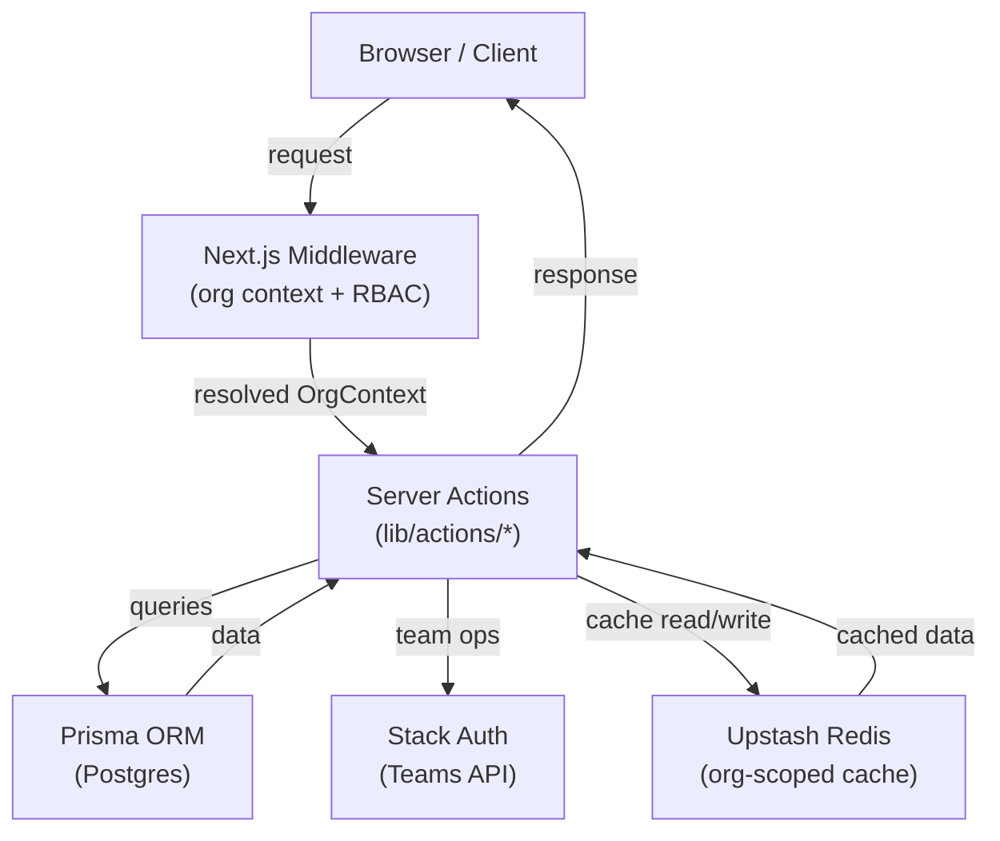

# Design Document: Multi-Tenant Organization Support

## Overview

This document describes the technical design for adding multi-tenant organization support to the inventory management application. The feature transforms the app from a single-user system into a multi-tenant SaaS platform where each organization (company) is a fully isolated tenant.

**Core responsibilities split:**
- **Stack Auth Teams** — identity, authentication, email invitations, and team membership at the auth layer
- **Prisma / Postgres** — organization metadata, member roles, product ownership, membership requests, and approval workflow
- **Upstash Redis** — org-scoped caching with `org:{organizationId}:*` key namespacing
- **Next.js middleware** — org context resolution and RBAC enforcement on every request

**Key design decisions:**
1. Stack Auth Teams are the source of truth for *who is in a team*; Prisma is the source of truth for *what role they hold* and *what data they own*.
2. The approval workflow (Requirement 5 & 8) is implemented entirely in Prisma — Stack Auth is only called when a request is actually approved.
3. Cache keys are namespaced by `organizationId`, not `userId`, to prevent cross-tenant cache pollution.
4. Middleware resolves org context from a cookie/session and injects it into every server action and page.

---

## Architecture



### Request Lifecycle

1. Request arrives at Next.js middleware.
2. Middleware calls `getCurrentUser()` — redirects to `/sign-in` if unauthenticated.
3. Middleware looks up the user's `Member` record in Prisma to resolve `organizationId` and `role`.
4. If no membership exists, redirect to `/onboarding`.
5. Middleware injects `x-org-id` and `x-org-role` headers for downstream consumption.
6. Server actions and page components read org context via `getOrgContext()` helper.
7. All Prisma queries are scoped with `where: { organizationId }`.
8. Cache keys use `org:{organizationId}:*` prefix.

---

## Components and Interfaces

### `lib/org.ts` — Org Context Helper

```typescript
export type OrgRole = "SUPER_ADMIN" | "MANAGER" | "STAFF";

export interface OrgContext {
  organizationId: string;
  role: OrgRole;
  userId: string;
}

/**
 * Reads org context from request headers (set by middleware).
 * Throws if context is missing — should never happen on protected routes.
 */
export async function getOrgContext(): Promise<OrgContext>

/**
 * Asserts the caller has at least the required role.
 * Throws an authorization error otherwise.
 */
export function requireRole(ctx: OrgContext, required: OrgRole | OrgRole[]): void
```

### `middleware.ts` — Org Context Resolution

```typescript
export async function middleware(request: NextRequest): Promise<NextResponse>
```

Responsibilities:
- Authenticate user via Stack Auth cookie
- Look up `Member` record for the user
- Redirect to `/onboarding` if no membership
- Inject `x-org-id` and `x-org-role` response headers
- Pass through to the route handler

Protected path patterns: `/dashboard`, `/inventory`, `/add-product`, `/settings`, `/org/*`

### `lib/actions/org.ts` — Organization Server Actions

```typescript
export async function createOrganization(formData: FormData): Promise<void>
export async function inviteMember(formData: FormData): Promise<void>
export async function getMembers(): Promise<MemberWithProfile[]>
```

### `lib/actions/membership.ts` — Membership Request Server Actions

```typescript
export async function submitMembershipRequest(formData: FormData): Promise<void>
export async function approveMembershipRequest(requestId: string): Promise<void>
export async function rejectMembershipRequest(requestId: string): Promise<void>
export async function getPendingRequests(): Promise<MembershipRequestWithDetails[]>
```

### `lib/actions/products.ts` — Updated Product Actions

Existing actions updated to:
- Replace `userId` with `organizationId` from org context
- Use `org:{organizationId}:*` cache key prefix

### Stack Auth Integration Points

| Operation | Stack Auth API |
|---|---|
| Create org | `stackServerApp.createTeam({ displayName, creator_user_id })` |
| Send invite | `stackServerApp.sendTeamInvitation({ team_id, email, callback_url })` |
| Add member (on approval) | `stackServerApp.addTeamMember({ team_id, user_id })` |
| Remove member (on approval) | `stackServerApp.removeTeamMember({ team_id, user_id })` |
| List pending invites | `stackServerApp.listTeamInvitations({ team_id })` |

### UI Pages

| Route | Component | Description |
|---|---|---|
| `/onboarding` | `app/onboarding/page.tsx` | Create org or wait for invite |
| `/org/settings` | `app/org/settings/page.tsx` | Org name, danger zone |
| `/org/members` | `app/org/members/page.tsx` | Member list + invite form |
| `/org/approvals` | `app/org/approvals/page.tsx` | Approval queue (Manager only) |

---

## Data Models

### Prisma Schema Changes

```prisma
model Organization {
  id          String   @id @default(cuid())
  name        String
  stackTeamId String   @unique  // Stack Auth Team ID

  createdAt   DateTime @default(now())
  updatedAt   DateTime @updatedAt

  members            Member[]
  products           Product[]
  membershipRequests MembershipRequest[]
  invitations        Invitation[]
}

enum Role {
  SUPER_ADMIN
  MANAGER
  STAFF
}

model Member {
  id             String       @id @default(cuid())
  userId         String       // Stack Auth User ID
  organizationId String
  role           Role

  createdAt      DateTime     @default(now())
  updatedAt      DateTime     @updatedAt

  organization   Organization @relation(fields: [organizationId], references: [id])

  @@unique([userId, organizationId])
  @@index([organizationId])
  @@index([userId])
}

model Invitation {
  id             String       @id @default(cuid())
  email          String
  organizationId String
  stackInviteId  String?      // Stack Auth invitation ID
  status         String       @default("PENDING")  // PENDING | ACCEPTED | REVOKED

  createdAt      DateTime     @default(now())
  updatedAt      DateTime     @updatedAt

  organization   Organization @relation(fields: [organizationId], references: [id])

  @@unique([email, organizationId])
  @@index([organizationId])
}

enum MembershipAction {
  ADD
  REMOVE
  UPDATE_ROLE
}

enum ApprovalStatus {
  PENDING
  APPROVED
  REJECTED
}

model MembershipRequest {
  id              String           @id @default(cuid())
  organizationId  String
  requesterId     String           // Stack Auth User ID of requester
  targetUserId    String           // Stack Auth User ID of target member
  action          MembershipAction
  newRole         Role?            // Only for UPDATE_ROLE action
  status          ApprovalStatus   @default(PENDING)
  approverId      String?          // Stack Auth User ID of approver/rejecter
  resolvedAt      DateTime?

  createdAt       DateTime         @default(now())
  updatedAt       DateTime         @updatedAt

  organization    Organization     @relation(fields: [organizationId], references: [id])

  @@unique([organizationId, targetUserId, action, status])  // prevents duplicate PENDING requests
  @@index([organizationId, status])
}

// Updated Product model
model Product {
  id             String       @id @default(cuid())
  organizationId String       // replaces userId
  name           String
  sku            String?      @unique
  price          Decimal      @db.Decimal(12, 2)
  quantity       Int          @default(0)
  lowStockAt     Int?

  createdAt      DateTime     @default(now())
  updatedAt      DateTime     @updatedAt

  organization   Organization @relation(fields: [organizationId], references: [id])

  @@index([organizationId, name])
  @@index([createdAt])
}
```

### Key Design Decisions

**Why store roles in Prisma instead of Stack Auth permissions?**
Stack Auth permissions are suitable for coarse-grained team access control, but the approval workflow, membership requests, and SUPER_ADMIN cross-tenant queries require querying role data from Prisma anyway. Keeping roles in Prisma avoids a round-trip to Stack Auth on every request and allows atomic transactions (e.g., approve request + update role in one transaction).

**Why the `@@unique` constraint on `MembershipRequest`?**
The constraint `[organizationId, targetUserId, action, status]` with `status = PENDING` effectively prevents duplicate pending requests for the same target+action combination (Requirement 8.6). When a request is approved or rejected, the status changes, allowing a new request to be submitted later.

**Why keep `stackTeamId` on Organization?**
All Stack Auth Team API calls require the `team_id`. Storing it on the Organization record avoids a lookup against Stack Auth on every invite or member management operation.

---

## Correctness Properties

*A property is a characteristic or behavior that should hold true across all valid executions of a system — essentially, a formal statement about what the system should do. Properties serve as the bridge between human-readable specifications and machine-verifiable correctness guarantees.*

### Property 1: Organization creator always receives MANAGER role

*For any* authenticated user and valid organization name, when the user successfully creates an organization, the resulting Member record for that user SHALL have the `MANAGER` role.

**Validates: Requirements 1.2**

---

### Property 2: Organization name validation rejects invalid inputs

*For any* string that is empty, composed entirely of whitespace, or longer than 100 characters, the organization creation function SHALL return a validation error and SHALL NOT create any Organization record or contact the Auth_Provider.

**Validates: Requirements 1.5**

---

### Property 3: Duplicate manager creation is rejected

*For any* user who already holds the `MANAGER` role in an existing organization, submitting a new organization creation request SHALL return an error and SHALL NOT create a new Organization record.

**Validates: Requirements 1.4**

---

### Property 4: Invalid email invitation is rejected

*For any* string that does not conform to a valid email format (RFC 5322), the invitation function SHALL return a validation error and SHALL NOT create an Invitation record or contact the Auth_Provider.

**Validates: Requirements 2.3**

---

### Property 5: Duplicate invitation is rejected

*For any* organization and any email address that already has a `PENDING` Invitation record within that organization, submitting a new invitation for the same email SHALL return an error and SHALL NOT create a duplicate Invitation record.

**Validates: Requirements 2.4**

---

### Property 6: Existing member invitation is rejected

*For any* organization and any email address that belongs to an active Member of that organization, submitting an invitation for that email SHALL return an error.

**Validates: Requirements 2.5**

---

### Property 7: Non-manager invitation is denied

*For any* user who does not hold the `MANAGER` role in an organization, attempting to invite a member to that organization SHALL return an authorization error.

**Validates: Requirements 2.6, 3.2**

---

### Property 8: Product queries are org-scoped

*For any* member of organization A, querying products SHALL return only products whose `organizationId` equals A's ID. No product belonging to any other organization SHALL appear in the result set.

**Validates: Requirements 4.2**

---

### Property 9: Member queries are org-scoped

*For any* member of organization A, querying the member list SHALL return only members whose `organizationId` equals A's ID. No member belonging to any other organization SHALL appear in the result set.

**Validates: Requirements 4.3**

---

### Property 10: Cross-tenant product access returns not-found

*For any* product P belonging to organization B, a member of organization A (where A ≠ B) requesting product P by ID SHALL receive a not-found response. The response SHALL NOT reveal that P exists in another organization.

**Validates: Requirements 4.4, 3.5**

---

### Property 11: Membership actions create PENDING requests without immediate effect

*For any* valid membership action (ADD, REMOVE, UPDATE_ROLE) submitted by any user, the system SHALL create a `MembershipRequest` record with `status = PENDING` and SHALL NOT apply the underlying membership change until the request is approved.

**Validates: Requirements 5.2, 8.1, 8.2, 8.8**

---

### Property 12: Self-targeting membership actions are rejected

*For any* manager, submitting a membership action that targets themselves SHALL return an error and SHALL NOT create a `MembershipRequest` record.

**Validates: Requirements 5.7**

---

### Property 13: Approval queue is org-scoped

*For any* manager of organization A, querying the approval queue SHALL return only `MembershipRequest` records whose `organizationId` equals A's ID and whose `status` is `PENDING`. No requests from other organizations SHALL appear.

**Validates: Requirements 8.3**

---

### Property 14: Duplicate pending requests are rejected

*For any* organization, target user, and action type, if a `MembershipRequest` with `status = PENDING` already exists for that combination, submitting another request for the same combination SHALL return an error and SHALL NOT create a duplicate record.

**Validates: Requirements 8.6**

---

### Property 15: Cross-org approval returns not-found

*For any* `MembershipRequest` belonging to organization B, a manager of organization A (where A ≠ B) attempting to approve or reject that request SHALL receive a not-found response.

**Validates: Requirements 8.7**

---

### Property 16: Non-manager approval queue access is denied

*For any* user who does not hold the `MANAGER` role in an organization, all approval queue read and write operations for that organization SHALL return an authorization error.

**Validates: Requirements 5.9, 8.10**

---

### Property 17: Cache keys are org-namespaced

*For any* org-scoped cache operation, the generated cache key SHALL begin with the prefix `org:{organizationId}:`. No cache key SHALL use a `userId`-based prefix for org-scoped data.

**Validates: Requirements 7.1**

---

### Property 18: Product mutations invalidate org cache

*For any* product create, update, or delete operation in organization A, all cache keys matching `org:{organizationId_A}:*` SHALL be invalidated. Cache keys for other organizations SHALL remain unaffected.

**Validates: Requirements 7.2**

---

## Error Handling

### Validation Errors (400)
- Organization name empty, whitespace-only, or > 100 characters
- Invalid email format for invitations
- Self-targeting membership actions

### Authorization Errors (403)
- Non-member accessing org-scoped resource
- STAFF attempting org management operations
- Non-manager attempting invite, approval, or rejection

### Not-Found Responses (404)
- Product ID from another organization
- MembershipRequest from another organization
- Member not in the requesting user's org

### Conflict Errors (409)
- User already holds MANAGER role (org creation)
- Duplicate pending invitation for same email
- Inviting an existing active member
- Duplicate pending MembershipRequest for same target+action

### Auth Provider Errors
- Stack Auth API failures are caught and wrapped in a descriptive server error
- Org creation is transactional: if Stack Auth team creation succeeds but Prisma write fails, the Stack Auth team is deleted to avoid orphaned teams
- Invitation failures from Stack Auth are surfaced to the user with a retry option

### Middleware Error Handling
- If the Member lookup fails (DB error), the middleware returns a 500 rather than silently redirecting
- If the user has multiple org memberships (future feature), the middleware selects the first and sets a cookie for the active org

---

## Testing Strategy

### Unit Tests (example-based)

Focus on specific behaviors and integration points:

- Organization creation happy path (valid name, no existing manager role)
- Invitation acceptance creates STAFF member record
- SUPER_ADMIN can read across tenants
- Unauthenticated requests redirect to sign-in
- Single-org user gets org context auto-set
- Approval happy path: approve ADD request creates Member + Stack Auth team member
- Approval happy path: approve REMOVE request deletes Member + Stack Auth team member
- Rejection sets status to REJECTED, leaves membership unchanged
- Notification sent on approval/rejection

### Property-Based Tests

Use [fast-check](https://github.com/dubzzz/fast-check) for TypeScript property-based testing. Each test runs a minimum of 100 iterations.

**Configuration:**
```typescript
// Tag format for each property test:
// Feature: multi-tenant-org, Property {N}: {property_text}
import fc from "fast-check";
```

Properties to implement as property-based tests:

| Property | Test Description |
|---|---|
| Property 1 | Generate random user IDs and org names; verify creator always gets MANAGER |
| Property 2 | Generate empty strings, whitespace strings, and strings > 100 chars; verify rejection |
| Property 3 | Generate users who are already managers; verify creation is rejected |
| Property 4 | Generate invalid email strings; verify invitation rejection |
| Property 5 | Generate orgs with existing PENDING invites; verify duplicate rejection |
| Property 6 | Generate orgs with existing members; verify re-invitation rejection |
| Property 7 | Generate users with STAFF role; verify invite is denied |
| Property 8 | Generate two orgs with products; verify member of org A never sees org B products |
| Property 9 | Generate two orgs with members; verify member of org A never sees org B members |
| Property 10 | Generate product IDs from org B; verify org A member gets not-found |
| Property 11 | Generate membership actions; verify PENDING record created, state unchanged |
| Property 12 | Generate managers; verify self-targeting is rejected |
| Property 13 | Generate two orgs with pending requests; verify queue only shows own org's requests |
| Property 14 | Generate existing PENDING requests; verify duplicate submission is rejected |
| Property 15 | Generate requests from org B; verify org A manager gets not-found |
| Property 16 | Generate STAFF users; verify all approval queue ops are denied |
| Property 17 | Generate org IDs; verify all cache keys start with `org:{id}:` |
| Property 18 | Generate product mutations in org A; verify only org A cache keys are invalidated |

### Integration Tests

- Stack Auth team creation and invitation flow (1-2 examples with mocked Stack Auth)
- Middleware correctly resolves org context from headers
- End-to-end: create org → invite member → accept invite → member can access products

### Migration Test

- Verify existing `Product` records are migrated from `userId` to `organizationId`
- Verify `userId` column is removed from `Product` table after migration
